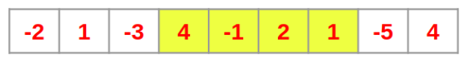
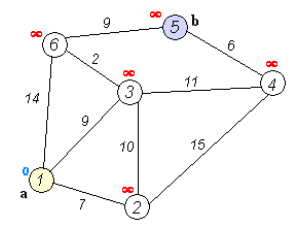

# Additional Topics

## Introduction
These are some random mixed questions, which will teach you something new to learn. We should never solve a question expecting it to come in our interview (even something similar), but to learn something new from it!  

Remember, we’re not trying to solve hundreds or thousands of questions, but to
- Understand the concepts
- Build problem solving skills
- Enjoy our time with questions
- Become a better developer

## Kadane’s algorithm
It’s used to solve the maximum subarray problem and the concept is to keep a track of the sum as you go -> and change it to 0 when it’s negative. (so you’re positive at the very least). An edge case is all negative numbers -> where you return the min of those.



## Djikstra’s algorithm 
Djikstra’s algorithm is a shortest path algorithm, where priority queue is used as the main data structure. Imagine an airplane flight network where we want the cheapest flight path from point A to B.
There’s also the shortest-path-tree which basically returns a tree with lowest cost from one node to another. So instead of just a short path from A to B, we do it for all the nodes in the graph.  



Let’s understand the algorithm:
The basic understanding is that we want to visit every node, mark them visited, calculate the cost until then, and finally return the shortest path. We can simply do a BFS (shortest path!) and use a Queue for
that.
Here’s the catch -> if we use a simple queue, then it would be hard to get the minimum element when we pop it off. So instead, we can use a priority queue -> where every time we pop something off, we get the minimum element.
Following the BFS principles, we add the node to the queue, pop it off, explore it’s neighbors + do some calculations for the route + mark them visited, and then repeat.  

```
function Dijkstra(Graph, source):
dist[source] ← 0 // Initialization
create vertex priority queue Q
for each vertex v in Graph:
if v ≠ source
dist[v] ← INFINITY // Unknown distance from source to v
prev[v] ← UNDEFINED // Predecessor of v
Q.add_with_priority(v, dist[v])
while Q is not empty: // The main loop
u ← Q.extract_min() // Remove and return best
vertex
for each neighbor v of u: // only v that are still in Q
alt ← dist[u] + length(u, v)
if alt < dist[v]
dist[v] ← alt
prev[v] ← u
Q.decrease_priority(v, alt)
return dist, prev
```

## AVL Trees

In a normal BST, the elements in the left tree are smaller than the root and the right ones are bigger than the root. It’s very useful for sorting and we can find the element in O(logN) time. There’s a catch ->
for the given nodes in an array -> there’s a format that we have to follow which generates multiple binary trees with different structures.  

[1,2,3] can generate a binary search tree with the root 3, left child 2, with left child 1 -> this is not what we wanted and hence we need something better.
AVL trees have a condition, the balance factor has to be in the range {-1,0,1}. So it’s a self balancing binary search tree.  

### Resources
- [AVL Tree - Insertion and Rotations](https://www.youtube.com/watch?v=jDM6_TnYIqE)
- [AVL tree - Wikipedia](https://en.wikipedia.org/wiki/AVL_tree)
- [AVL Tree Visualization](https://www.cs.usfca.edu/~galles/visualization/AVLtree.html)


## Sorting
Sorting is super important as a concept but not super important in terms of knowing everything about them. For questions, you can use .sort() to sort whatever you’re using, and rarely you’ll be asked to actually implement the underlying algorithms.
Read more here: [Sorting Algorithm](https://en.wikipedia.org/wiki/Sorting_algorithm)  

Here’s a great visualizer for all sorting algorithms: [Sorting Algorithms Animations](https://www.toptal.com/developers/sorting-algorithms)
Another one more: [Brute Force - Bubble](https://algorithm-visualizer.org/brute-force/bubble-sort)

