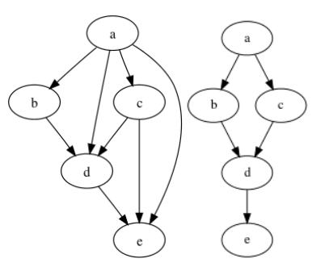

# Topological sorting

## Introducton
The name suggests sorting, so it probably should be :P. Here’s the definition: “topological ordering of a directed graph is a linear ordering of its vertices such that for every directed edge uv from vertex u
to vertex v, u comes before v in the ordering”  
In simple words, we need to sort then in such a way that that the ‘prerequisite’ comes before all the others and we have a directed structure from one node to another.



Let’s understand this with CLASSES at your school/college/university. You have to take calculus before taking advanced mathematics and you have to take basic programming before moving forward -> that’s topological sorting. You can make your class schedule using this algorithm.  
Let’s convert this to code, step by step.
Firstly, we want to cover all the nodes so we can use a stack or queue. It’s a DAG and we’re concerned about the depth, so let’s use a stack. Queue is also an option here. We have an array given to us, let’s iterate over that -> go as deep as possible and add that to our set. We want to go to the last node and begin from there.

```
L ← Empty list that will contain the sorted elements
S ← Set of all nodes with no incoming edge
while S is not empty do
remove a node n from S
add n to L
for each node m with an edge e from n to m do
remove edge e from the graph
if m has no other incoming edges then
insert m into S
if graph has edges then
return error (graph has at least one cycle)
else
return L (a topologically sorted order)
```

Removing edge means marking it visited and never coming back to it again. So here’s what the first thing looks like.
```
for(int i=0; i < nodes.length; i++){
if(visited[i] == false){
visited[i] = true;
toposort(i, visited, adj, s);
}
}
// Print the stack here -> it’s sorted!
```

We have to define toposort() which does the same thing -> takes the pointer to the very last node, adds
it to the stack, marks them visited along the way, and then eventually fills up the array. Here’s the
toposort function:
```
toposort(int i, boolean visited[], adj[][], Stack<> stack){
 for(int x : adj.get(i)){
 if(visited[x] == false){
 visited[x] = true;
 toposort(x, visited, adj, stack);
 }
 }
 stack.push(i);
}
```
After filling up the stack, we print out all the items from that in a sorted form. 

## Resources
- [- Topological Sort Graph | Leetcode 207 | Course Schedule](https://youtu.be/rG2-_lgcZzo)
- [ [LeetCode]Course Schedule. May 30-Day Challenge | by Yinfang](https://medium.com/@yzhua3/leetcode-course-schedule-642d91dbd425)
- [Definition: Wikipedia](https://en.wikipedia.org/wiki/Topological_sorting)
- [Visualizer: Branch and Bound - Topological Sort](https://algorithm-visualizer.org/branch-and-bound/topological-sort)
- [ Topological Sort Algorithm | Graph Theory](https://youtu.be/eL-KzMXSXXI)
- [ Topological Sort | Kahn's Algorithm | Graph Theory](https://youtu.be/cIBFEhD77b4)

## Questions
- [Topological Sort](https://leetcode.com/tag/topological-sort/)
- [Leetcode : Find the Town Judge](https://leetcode.com/problems/find-the-town-judge/)
- [LeetCode 210. Course Schedule II](https://leetcode.com/problems/course-schedule-ii/)

