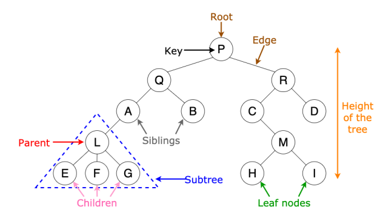

# Trees

## Introduction

I love trees, but actual ones - not these. Just kidding, I love all data structures. Let’s discuss trees.
They’re tree-like structures (wow) where we can store different things, for different reasons, and then use them to our advantage. Here’s a nice depiction of how the actually look:



Recursion is a great way to solve a lot of tree problems, but the iterative ones actually bring out the beauty of them. Making a stack and queue, adding and popping things from that, exploring children, and repeating this would definitely make sure you understand it completely. You should be seeing this visually in your head, when you do it iteratively.

## Pattern: Traversals

There are 3 major ways to traverse a tree and some other weird ones: let’s discuss them all. The most famous ones are pre, in, and post - order traversals. Remember, in traversals -> it’s not the left or
right node (but the subtree as a whole).

### Inorder traversal
Let’s start with inorder traversal: We define a stack and will traverse the tree iteratively. Recursive solutions to these 3 basic ones are pretty straightforward, so we’ll try to understand them a little more
with iterative ones.
We start with the root, move until it’s null or the stack is empty. We move to the left if we can, if not -> we pop, add the popped value and then move right.

```
List<Integer> res = new ArrayList<>();
if(root==null) return res;
Stack<TreeNode> stack = new Stack<>();
TreeNode curr = root;
while(curr!=null || !stack.isEmpty()){
 if(curr!=null){
 stack.push(curr);
 curr = curr.left;
 }else{
 curr = stack.pop();
 res.add(curr.val);
 curr = curr.right;
 }
}
return res;
```

### Pre order traversal
We add the root, then the left subtree, and then the right subtree. It’s a stack so things work in the opposite direction -> first in last out, so make sure to check that carefully.

```
Stack<Node> stack = new Stack();
stack.push(root);
result = [];
while (!stack.empty())
{
 Node curr = stack.pop();
 result.push(curr.data);
 // print node
 if (curr.right != null) {
 stack.push(curr.right);
 }
 if (curr.left != null) {
 stack.push(curr.left);
 }
}
```

### Post order traversal
We visit the left subtree, then the right subtree, and then the root. So we simply add the left item first, then the right item, and the root. 

```
Stack<Node> stack = new Stack();
stack.push(root);
result = []
while (!stack.empty())
{
 Node curr = stack.pop();
 result.push(curr.data);
 if (curr.left != null) {
 stack.push(curr.left);
 }
 if (curr.right != null) {
 stack.push(curr.right);
 }
}
// Print the REVERSE of the result.
// Or store it in a stack
```

### Additional questions
- [ LeetCode 102 - Binary Tree Level Order Traversal [medium]](https://leetcode.com/problems/binary-tree-level-order-traversal/)
- [ Kth Smallest Element in a BST](https://leetcode.com/problems/kth-smallest-element-in-a-bst/description/)
- [- Leetcode #98 Validate Binary Search Tree](https://leetcode.com/problems/validate-binary-search-tree/)
- [- Binary Tree Zigzag Level Order Traversal](https://leetcode.com/problems/binary-tree-zigzag-level-order-traversal/)


## Resources
- [ Leetcode Pattern 0 | Iterative traversals on Trees | by csgator | Leetcode Patterns](https://medium.com/leetcode-patterns/leetcode-pattern-0-iterative-traversals-on-trees-d373568eb0ec)
- [- Inorder Tree Traversal – Iterative and Recursive – Techie Delight](https://www.techiedelight.com/inorder-tree-traversal-iterative-recursive/)
- [- Data structures: Introduction to Trees](https://youtu.be/qH6yxkw0u78)

## Questions
- [- Leetcode - Binary Tree Preorder Traversal](https://leetcode.com/problems/binary-tree-preorder-traversal/)
- [- Leetcode #94 Binary Tree Inorder Traversal](https://leetcode.com/problems/binary-tree-inorder-traversal/)
- [- Leetcode #98 Validate Binary Search Tree](https://leetcode.com/problems/binary-tree-postorder-traversal/)
- [- 783. Minimum Distance Between BST Nodes](https://leetcode.com/problems/minimum-distance-between-bst-nodes/)
- [ Symmetric Tree](https://leetcode.com/problems/symmetric-tree/)

- [- Binary Search Tree Iterator](https://leetcode.com/problems/binary-search-tree-iterator/)
- [- 96. Unique Binary Search Trees](https://leetcode.com/problems/unique-binary-search-trees/)
- [- Serialize and Deserialize BST](https://leetcode.com/problems/serialize-and-deserialize-bst/)
- [- Binary Search Tree Iterator](https://leetcode.com/problems/binary-search-tree-iterator/)

