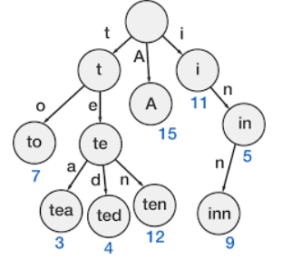

# Tries

## Introduction

Tries are also a type of prefix trees which are tree-like structures to store strings. Let's start with a question: You have 2 strings and we want to find the common letters in it. The first brute force way is to iterate over the first string, add the letters to a set -> then iterate over the
next string and see all the elements that are in the set. You could also do things like string2.contains(char) -> but it’s the same thing wrt time complexity.
We can insert and find strings in O(L) time, where L is the length of the string. Another use case can be to print the characters in order. 



## Implement Trie
We’re going to implement the trie here and understand how it works. A lot of times -> you would have to implement this on the side and then use it in a question, so we’re going to discuss a question as well. At the same time, the question could also be “search for a letter” -> where we can just use the search function.  

First, we want to decide how the Node class looks like. Every node needs to hold a map of the children and a boolean which tells if it is the last node (leaf node / last character):
```
class TrieNode:
 def __init__(self):
 self.children = {}
 self.isLast = False
```


We need the Trie class now. The major functions are insert, search, startsWith -> where we can also add more -> delete, findChar, etc. Let’s begin the insert function.

### Insert
We want to insert a character at the very end of the trie. The first part of that is iterating down and finding the last character (through the isLast field of TrieNode) and then add the character to the map.
The letter which we’ll add will be a TrieNode() and not just a character. Every node is a TrieNode -> which has those 2 things.  
Here’s how we do it
- Iterate over the word - every letter
- Iterating forward -> node = node.children[letter]
- We add the letter there -> node.children[letter] = TrieNode()

```
def insert(self, word):
 node = self.root
 for letter in word:
 if letter not in node.children:
 node.children[letter] = TrieNode()

 node = node.children[letter]

 node.isLast = True
```

### Searching
We want to search for a character or stream of characters in a string.
Here are the steps:
- Iterate over the letters
- If the letter is not in node.children -> return false. Remember, node.children is a dictionary of the letter mappings for the children, -> so it should be there.
- Iterating forward -> node = node.children[letter]
- If we reach the end without returning false, we return if it’s the last element or not -> using the isLast class field.

```

def search(self, word):
 node = self.root
 for letter in word:
 if letter not in node.children:
 return False

 node = node.children[letter]
 return node.isLast
 ```

 ### Starts With
 We want to return true if the string (prefix) is at the start of a word. We can simply use the class field to our advantage and find the right answer here.
Here are the steps
- Iterate over the letters
- If the letter is not in node.children -> return false. Remember, node.children is a dictionary of the letter mappings for the children, -> so it should be there.
- Iterating forward -> node = node.children[letter]

```
def startsWith(self, prefix):
 node = self.root
 for letter in prefix:
 if letter not in node.children:
 return False
 node = node.children[letter]
 return True
```

## Resources
- [- Trie Data Structure - Beau teaches JavaScript](https://youtu.be/7XmS8McW_1U)
- [- Trie Data Structure Implementation (LeetCode) ](https://youtu.be/giiaIofn31A)


## Questions
- [Leetcode 208. Implement Trie (Prefix Tree)](https://leetcode.com/problems/implement-trie-prefix-tree/)
- [Leetcode 139. Word Break](https://leetcode.com/problems/word-break/)
- [Leetcode Word Break II](https://leetcode.com/problems/word-break-ii/)
- [Leetcode 212. Word Search II](https://leetcode.com/problems/word-search-ii/)
- [Leetcode 1032 Stream of Characters](https://leetcode.com/problems/stream-of-characters/)
- [Leetcode 421 Maximum Xor of Two Numbers in an Array](https://leetcode.com/problems/maximum-xor-of-two-numbers-in-an-array/)

