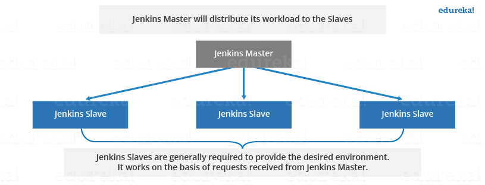

# Jenkins

# Introduction
Jenkins is an open source automation tool written in Java programming language that allows continuous integration.

Jenkins builds and tests our software projects, which continuously making it easier for developers to integrate changes to the project, and making it easier for users to obtain a fresh build.

## What is Jenkins?
Jenkins is an open source automation tool written in Java programming language that allows continuous integration.

Jenkins regularly builds and tests our software projects, making it simpler for developers to incorporate changes into the project and simpler for consumers to get a new build.

By integrating with a wide range of testing and deployment tools, it also enables us to provide our software continually.

Jenkins provides a simple method for automating other common development chores as well as setting up a continuous integration or continuous delivery environment for practically any collection of languages and source code repositories.

Jenkins uses plugins to achieve CI (Continuous Integration). The different DevOps steps may be integrated via plugins. Installing the utility's plugins is necessary if you wish to incorporate that tool. Maven 2 Project, Git, HTML Publisher, Amazon EC2, etc. are a few examples.

## What is Continuous Integration?

As part of the continuous integration (CI) development process, developers must periodically submit updated versions of the source code to a common repository. The repository is then generated for each commit that is made. This enables the development teams to find issues early on.
Continuous integration requires the developers to have regular builds. The general practice is that whenever a code commit occurs, a build should be triggered.

## Jenkins Architecture
Jenkins follows Master-Slave architecture to manage distributed builds. In this architecture, slave and master communicate through TCP/IP protocol.

Jenkins architecture has two components:

- Jenkins Master/Server
- Jenkins Slave/Node/Build Server

### Jenkins Master
The main server of Jenkins is the Jenkins Master. It is a web dashboard which is nothing but powered from a war file. By default it runs on 8080 port. With the help of Dashboard, we can configure the jobs/projects but the build takes place in Nodes/Slave. By default one node (slave) is configured and running in Jenkins server. We can add more nodes using IP address, user name and password using the ssh, jnlp or webstart methods.

The server's job or master's job is to handle:
- Scheduling build jobs.
- Dispatching builds to the nodes/slaves for the actual execution.
- Monitor the nodes/slaves (possibly taking them online and offline as required).
- Recording and presenting the build results.
- A Master/Server instance of Jenkins can also execute build jobs directly.

### Jenkins Slave

The build jobs assigned by the master are carried out by the Jenkins slave. We can set up a project such that it always uses a specific slave machine, a specific kind of slave machine, or we can just let Jenkins choose the next slave or node that becomes available.  

As we know Jenkins is developed using Java is platform independent thus Jenkins Master/Servers and Slave/nodes can be configured in any servers including Linux, Windows, and Mac.

## Resources
- [jenkins - Tutorials](https://www.jenkins.io/doc/tutorials/)
- [jenkins - javatpoint](https://www.javatpoint.com/jenkins)
- [Jenkins complete course](https://www.youtube.com/watch?v=FX322RVNGj4&t=0s)
- [CI/CD week](https://youtube.com/playlist?list=PL5uLNcv9SibC0Osfk9Nhf7MgP2UNzZkDR)
- 
