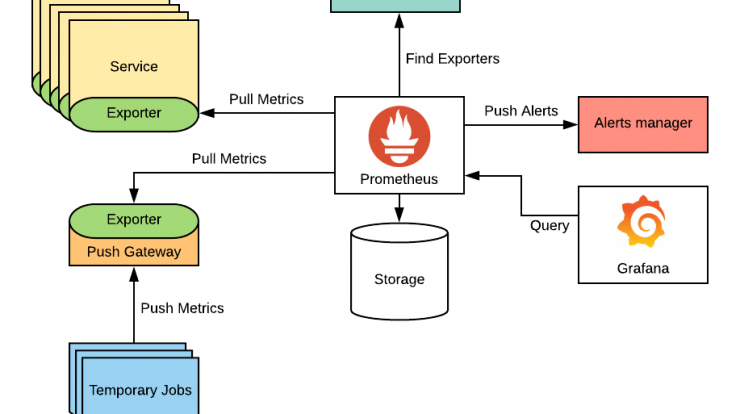

# Prometheus

# Introduction
Prometheus is a toolset, which includes open-source alerting and monitoring technologies. It was initially constructed on SoundCloud. This idea has received approval from several groups and businesses. Since its launch in 2012, it has a thriving user community and developer. It is now an open-source project that is run without corporate interference. After Kubernetes, the Cloud Native Computing Foundation was a second hosted project by Prometheus in 2016.

## Architecture of Prometheus Monitoring

### Working of Prometheus
Prometheus is a toolset, which includes open-source alerting and monitoring technologies. It was initially constructed on SoundCloud. This idea has received approval from several groups and businesses. Since its launch in 2001, it has a thriving user community and developer base.  

Prometheus uses instrumented tasks to assemble metrics. Samples may be kept locally. Additionally, it may be searched using rules to either record or gather any new time-series using the data already there and to generate design alerts. Indicators for these measures include histograms, gauges, and counters. Plaintext data can be transferred through HTTP.  

## Features of Prometheus

Some primary aspects of Prometheus are discussed as follows:

- Several dashboards and graphing modes support
- Representation of time series assemblage from any pull model on HTTP
- Multidimensional data model presenting time series data, i.e., recognized with the name of the metric or with KVP (Key-value pairs)
- Capability to apply PromQL for supporting the multidimensionality feature of a data model
- Zero reliance over distributed storage and autonomous individual server nodes
- Target discovery from service discovery or static configuration
- Capability to manage time series from any intermediary gateway

## Components of Prometheus

Prometheus components are mostly defined in a programming language, i.e., Go, and can be deployed and built as static binaries. Many of its components are optional.

Its components are:

1. Metrics are scraped and stored on **Prometheus' server**. The persistence layer is used. The manual does not explicitly identify this layer, which is a component of the server. This server's nodes are all independent and do not rely on distributed storage.
2. We can chart, display, and retrieve stored data thanks to the online UI. The **UI of Prometheus** is made easier. Additionally, we may set up additional visualisation tools, like Grafana, to use Prometheus Query Language to connect to the Prometheus server (PromQL).
3. **Alertmanager** sends alerts via client programmes like Prometheus server. It can route from other systems like OpsGenie and PagerDuty and has comprehensive features for routing, aggregating, and deduplicating alerts.

## Resources
- [Prometheus CNCFMinutes](https://www.youtube.com/watch?v=llwxJ0VdYWY&t=0s)
- [Intro to Kubernetes monitoring](https://youtu.be/B5UY-qeW96I)

