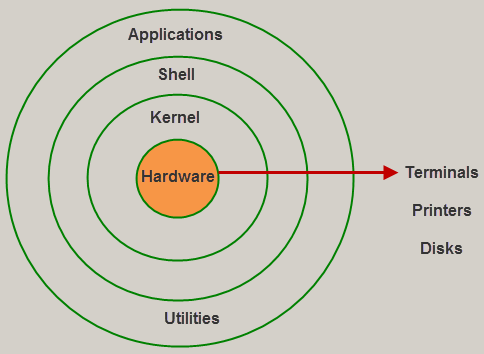

# Linux

# Introduction
Linux, like other operating systems such as Microsoft Windows, Apple Mac OS, iOS, and Google Android, is an open-source operating system. An operating system is a piece of software that allows computer hardware and software to communicate with one another. It transports input to the processor for processing and output to the hardware for display. This is the most fundamental function of an operating system. Let us not go into detail about its many other important functions.

Linux has been around since the mid-1990s. It can be found in everything from wristwatches to supercomputers. It's in our phones, laptops, PCs, cars, and even refrigerators. It is well-known among both developers and regular computer users.  

## Evolution of Linux OS
Linus Torvalds created the Linux operating system in 1991 as an attempt to improve the UNIX operating system. He proposed improvements but was turned down by UNIX designers. As a result, he considered launching an operating system that could be modified by its users.

## Structure Of Linux Operating System
An operating system is a collection of software, each designed for a specific function.  

## Why use Linux?
This is one of the most frequently asked questions regarding Linux systems. Why do we use a different, more complex operating system when we have a simple one like Windows? So there are various features of Linux systems that make it unique and one of the most widely used operating systems. If you want to get rid of viruses, malware, slowdowns, crashes, costly repairs, and other issues, Linux may be the ideal operating system for you. It also has several advantages over other operating systems, and we don't have to pay for it. Let's take a look at some of its unique features that will entice you to upgrade your operating system.  

## Resources
- [javatpoint - Linux Tutorial](https://www.javatpoint.com/linux-tutorial)
- [Introduction to Linux](https://www.edx.org/course/introduction-to-linux)
- [Linux/Unix - Tutorial](https://www.guru99.com/unix-linux-tutorial.html)

